# Design Document

> Keep this document brief (2–4 pages), clear, and up-to-date throughout the project.
> You may use Mermaid diagrams for architecture visuals.

| Field          | Value (fill in)              |
| -------------- | ---------------------------- |
| Project Name   |  Mobilio                            |
| Team Members   | Vegar, Mathias, Fredrik                              |
| Repository URL |https://github.com/dat515-2025/Group-7                              |
| Version        | v1.0 |
| Last Updated   | 2025-11-16                   |

## How to use this template

- Replace all placeholders with your project-specific content.
- Keep explanations concise; link to code or docs when helpful.
- Update this document as the design evolves to match the final implementation.

---

## 1. Overview

Briefly describe the application and its purpose.

- **Problem statement**: Building a modern, scalable e-commerce platform for selling mobile phones and accessories with intelligent product recommendations and robust cloud infrastructure.
  
- **Target users / personas**: 
  - Tech-savvy consumers looking for the latest smartphones
  - Budget-conscious shoppers seeking good deals
  - Non-technical users needing an intuitive shopping experience
  - Mobile enthusiasts interested in accessories and upgrades

- **Primary objectives**:
  - Provide a user-friendly, responsive React-based UI
  - Implement ML-powered product recommendation engine
  - Deploy on Kubernetes (GKE) with load balancing and auto-scaling
  - Integrate cloud-based image storage (AWS S3)
  - Ensure high availability and disaster recovery
  - Implement comprehensive monitoring and observability

- **Non-goals**:
  - Mobile native applications (iOS/Android)
  - Multiple payment providers (focusing on Stripe only)
  - Multi-language/internationalization support
  - Social media integration

- **Key features**:
  - Product browsing with filtering and sorting
  - Secure user authentication (JWT-based)
  - Stripe payment integration
  - ML-powered product recommendations (similar products, co-purchase patterns)
  - Admin dashboard for product management

## 2. Architecture

High-level architecture, main components, interactions, and data flow. Include a system diagram.

### 2.1 System diagram

**Components and responsibilities:**
- **Nginx Ingress**: Entry point, SSL termination, load balancing, routing to frontend/backend
- **React Frontend**: Single-page application, user interface, client-side routing
- **FastAPI Backend**: RESTful API, business logic orchestration, authentication middleware
- **ML Recommendation Service**: Product similarity analysis, co-purchase recommendations, ML model training
- **Authentication Service**: JWT token generation/validation, password hashing, user management
- **Product Service**: Product CRUD operations, search, filtering, image management via S3
- **Cart Service**: Shopping cart management, session handling via Redis
- **Order Service**: Order creation, history, status tracking
- **Payment Service**: Stripe integration, payment session creation, webhook handling
- **Redis Cache**: Session storage, cart caching, API response caching, rate limiting
- **MySQL Main DB**: Primary relational database for users, products, orders, carts
- **Analytics DB**: Separate database for ML training data, product interactions, purchase patterns
- **Prometheus**: Metrics collection from FastAPI and containers
- **Grafana**: Metrics visualization, custom dashboards, alerting

**Data flow:**
1. User request → Nginx Ingress → Routes to React (static) or API endpoints
2. Frontend API calls → Backend → Service layer → Redis (cache check) → MySQL (if cache miss)
3. Recommendation requests → ML Service → Reads from both MySQL and Analytics DB
4. Payment flow → Payment Service → Stripe API → Order creation in MySQL
5. Product images → Uploaded to S3 → URLs stored in MySQL
6. Metrics → Backend → Prometheus → Grafana visualization

**State management:**
- **Session state**: Redis (user sessions, cart data, temporary tokens)
- **Persistent state**: MySQL (users, products, orders, cart items)
- **Analytics state**: Analytics DB (ML training data)
- **Binary state**: AWS S3 (product images)
- **Client state**: React Context API (auth state)

**External dependencies:**
- **Stripe API**: Payment processing, webhook events for order confirmation
- **AWS S3**: Object storage for product images via boto3
- **Google Cloud Platform**: GKE cluster hosting, load balancers, persistent disks

### 2.2 Data model (if applicable)

### 2.3 APIs (REST/gRPC/GraphQL)

**Interface style**: RESTful APIs using FastAPI with OpenAPI/Swagger documentation

**Rationale**: 
- FastAPI provides automatic OpenAPI schema generation
- Type validation with Pydantic models
- High performance with async support
- Interactive API documentation at `/api/docs`

**Key Backend API Endpoints** (Port 8000):
- `POST /api/auth/register` - User registration
- `POST /api/auth/login` - User authentication, returns JWT token
- `GET /api/products` - List products with filtering/sorting
- `GET /api/products/{id}` - Get product details
- `POST /api/cart/items` - Add item to cart
- `GET /api/cart` - Get user's cart
- `POST /api/orders` - Create order from cart
- `GET /api/orders` - Get user's order history
- `POST /api/payment/create-session` - Create Stripe checkout session
- `GET /api/health` - Health check endpoint
- `GET /metrics` - Prometheus metrics endpoint

**Recommendation API Endpoints** (Port 8080):
- `GET /api/similar/{product_id}` - Get similar products using ML
- `GET /api/copurchase/{product_id}` - Get frequently bought together items
- `POST /api/train` - Train ML recommendation models
- `POST /api/sync-data` - Sync production data to analytics DB

## 3. Technologies

List the cloud services, libraries, and tools you will use and why.

| Technology / Service | Role / Where Used | Why chosen (brief) | Alternatives considered |
| -------------------- | ----------------- | ------------------ | ----------------------- |
| **FastAPI** | Backend API framework | High performance, automatic OpenAPI docs, async support, type validation | Flask, Django REST Framework |
| **React 19** | Frontend framework | Component-based, large ecosystem, team experience | Vue.js, Angular |
| **Material-UI** | UI component library | Professional design system, comprehensive components | Ant Design, Chakra UI |
| **MySQL 8** | Primary database | ACID compliance, relational data modeling, team familiarity | PostgreSQL, MongoDB |
| **Redis 7** | Cache & session store | In-memory speed, session management, simple key-value storage | Memcached, Valkey |
| **Nginx** | Ingress controller & reverse proxy | Industry standard, proven load balancing, experience from labs | Traefik, Caddy |
| **Kubernetes (GKE)** | Container orchestration | Auto-scaling, load balancing, self-healing, managed service | Docker Swarm, ECS, self-managed K8s |
| **Docker** | Containerization | Standard containerization, reproducible builds, experience from labs | Podman, containerd |
| **Google Cloud Platform** | Cloud provider | GKE managed Kubernetes, free credits, easy setup | AWS, Azure, OpenStack |
| **AWS S3** | Object storage | Reliable image storage, CDN integration, industry standard | Google Cloud Storage, MinIO |
| **Stripe** | Payment processing | Developer-friendly API, comprehensive documentation, test mode | PayPal, Square |
| **Prometheus** | Metrics collection | Time-series DB, powerful queries, Kubernetes-native | Datadog, New Relic |
| **Grafana** | Metrics visualization | Rich dashboards, Prometheus integration, alerting | Kibana, Datadog |
| **SQLAlchemy** | Python ORM | Type-safe DB access, migration support, widely used | Django ORM, Tortoise ORM |
| **Pydantic** | Data validation | Type validation, FastAPI integration, automatic docs | Marshmallow, Cerberus |
| **PyJWT** | JWT tokens | Secure authentication, stateless sessions | python-jose |
| **scikit-learn** | ML library | Product similarity algorithms, co-purchase analysis | TensorFlow, PyTorch (overkill) |

**Languages & Frameworks:**
- **Backend**: Python 3.11+ with FastAPI, SQLAlchemy, Pydantic
- **Frontend**: JavaScript (React 19), Material-UI, React Router, Axios
- **Database**: MySQL 8 with relational schema design
- **ML/Analytics**: Python with scikit-learn, NumPy for recommendations

**Cloud Services:**
- **Compute**: Google Kubernetes Engine (GKE) with auto-scaling node pools
- **Storage**: AWS S3 for product images
- **Load Balancing**: GKE Ingress with Google Cloud Load Balancer
- **Monitoring**: Prometheus + Grafana stack deployed in cluster

**CI/CD & Infrastructure:**
- **Containerization**: Docker with multi-stage builds
- **Orchestration**: Kubernetes YAML manifests for deployments, services, ingress
- **Version Control**: Git with GitHub for code repository

## 4. Deployment

Describe the deployment strategy and infrastructure requirements.

**Deployment Strategy:**

The application uses a cloud-native deployment strategy with Kubernetes on Google Cloud Platform.

**Environments:**
- **Local Development**: Docker Compose for running all services locally
- **Production**: Google Kubernetes Engine (GKE) cluster with load balancing and auto-scaling

**Runtime Platform:**
- **Container Runtime**: Docker containers for all services
- **Orchestration**: Kubernetes (GKE) for production deployment
- **Local Testing**: Docker Compose with 11 services
- **Database**: Managed MySQL on Kubernetes with persistent volumes

**Infrastructure Diagram:**

```mermaid
graph TB
    User([👤 User])
    
    subgraph Entry["🌐 Entry Point"]
        Nginx[Nginx<br/>:80]
    end
    
    subgraph Frontend["💻 Frontend Layer"]
        React[React App<br/>:3000]
    end
    
    subgraph Backend["⚙️ Backend Services"]
        API[FastAPI Backend<br/>:8000]
        Rec[ML Recommendation<br/>:8080]
    end
    
    subgraph Cache["⚡ Cache Layer"]
        Redis[(Redis Cache<br/>:6379)]
    end
    
    subgraph Data["💾 Database Layer"]
        MySQL[(MySQL<br/>Main DB<br/>:3306)]
        Analytics[(Analytics DB<br/>:3307)]
    end
    
    subgraph External["☁️ External Services"]
        Stripe[Stripe<br/>Payments]
        S3[AWS S3<br/>Images]
    end
    
    subgraph Monitor["📊 Monitoring"]
        Prom[Prometheus<br/>:9090]
        Graf[Grafana<br/>:3001]
    end
    
    %% Main Request Flow
    User -->|1. HTTP Request| Nginx
    Nginx -->|2a. Serve Static| React
    Nginx -->|2b. /api/*| API
    Nginx -->|2c. /api/recommendation/*| Rec
    
    %% Frontend Interactions
    React -.->|3. API Calls| Nginx
    
    %% Backend Data Flow
    API -->|1. Check Cache| Redis
    Redis -.->|Cache Miss| API
    API -->|2. Query/Update| MySQL
    API -->|Process Payment| Stripe
    API -->|Upload| S3
    API -->|Track Events| Analytics
    
    %% Recommendation Flow
    Rec -->|Read Products| MySQL
    Rec -->|ML Data| Analytics
    
    %% Monitoring Flow
    API -->|Metrics| Prom
    Prom -->|Visualize| Graf
    
    %% Styling
    style User fill:#e3f2fd,stroke:#1976d2,stroke-width:3px
    style Nginx fill:#fff3e0,stroke:#f57c00,stroke-width:2px
    style React fill:#e8f5e9,stroke:#388e3c,stroke-width:2px
    style API fill:#e8f5e9,stroke:#388e3c,stroke-width:2px
    style Rec fill:#e8f5e9,stroke:#388e3c,stroke-width:2px
    style MySQL fill:#ffebee,stroke:#c62828,stroke-width:2px
    style Analytics fill:#ffebee,stroke:#c62828,stroke-width:2px
    style Redis fill:#fff9c4,stroke:#f9a825,stroke-width:2px
    style Stripe fill:#f3e5f5,stroke:#7b1fa2,stroke-width:2px
    style S3 fill:#f3e5f5,stroke:#7b1fa2,stroke-width:2px
    style Prom fill:#eceff1,stroke:#455a64,stroke-width:2px
    style Graf fill:#eceff1,stroke:#455a64,stroke-width:2px
```

**Configuration & Secrets:**
- Environment variables for all service configuration
- `.env` files for local development (git-ignored)

**Scaling Strategy:**

---

## Optional Sections

Include the sections below as applicable to your project.

### Security

**Authentication:**
- JWT (JSON Web Tokens) for stateless authentication
- Tokens issued on successful login with 30-minute expiration
- Passwords hashed using Argon2 (OWASP recommended)
- Password validation: minimum length, complexity requirements
- Secure token storage in browser localStorage (with XSS protections)

**Authorization:**
- Role-based access control (RBAC): `customer` and `admin` roles
- Frontend route protection: Admin pages require admin role
- Backend endpoint protection: JWT middleware validates all protected routes
- User-specific resource access: Users can only access their own cart, orders, profile
- Admin endpoints for product management restricted to admin role

**API Security:**
- CORS configured to allow only trusted origins
- Input validation with Pydantic models
- SQL injection prevention via SQLAlchemy ORM

**Secrets Management:**
- stored in local .env files

**Additional Measures:**
- Security headers (HSTS, CSP, X-Frame-Options) via Nginx
- Regular dependency updates for vulnerability patches
- Container image scanning for vulnerabilities
- Least privilege principle for service accounts
### Scalability

**Expected Load:**

**Performance Targets:**

**Bottlenecks & Solutions:**

### Monitoring & Logging

**Metrics Collection:**
- **Prometheus** scrapes metrics every 5 seconds from:
  - FastAPI backend: Request counts, latencies, error rates
  - Container metrics: CPU, memory, network I/O (via cAdvisor in local setup)
  - Custom business metrics: Orders created, products viewed, cart conversions
- **Instrumentation**: 
  - `prometheus-fastapi-instrumentator` for automatic HTTP metrics
  - Custom gauges for active users, cart items, inventory levels
  - Histograms for request duration distribution

**Visualization:**
- **Grafana Dashboards** (Port 3001):
  - System overview: CPU, memory, disk usage across all pods
  - API performance: Request rate, error rate, latency percentiles (p50, p95, p99)
  - Business metrics: Orders per hour, revenue tracking, popular products
  - Database performance: Query times, connection pool usage
  - Recommendation service: ML inference time, cache hit rate
- Pre-configured dashboards provisioned automatically
- Alert rules for critical thresholds (high error rates, latency spikes)

**Logging Strategy:**
- **Application logs**: 
  - Structured JSON logging from FastAPI
  - Log levels: DEBUG (dev), INFO (prod), WARNING, ERROR
  - Request/response logging with correlation IDs
- **Container logs**: 
  - Aggregated via Kubernetes logging
  - Accessible via `kubectl logs` command
  - (Future: Centralized logging with ELK or Loki stack)

**Health Checks:**
- Kubernetes liveness probes: `/api/health` endpoint
- Readiness probes: Database connectivity check
- Startup probes: Service initialization verification

### Disaster Recovery

**Backup Strategy:**

**Restore Procedures:**

**Failure Scenarios & Mitigation:**

**Testing:**
- Quarterly disaster recovery drills
- Automated backup verification
- Chaos engineering experiments (pod kills, network failures)

### Cost Analysis

**Main Cost Drivers:**
1. **Google Kubernetes Engine (GKE)**:
   - Cluster management: $0.10/hour ($73/month)
   - Worker nodes: 3x e2-small instances @ $13.68/month = $41.04/month
   - Load balancer: $18/month
   - Persistent disks: 3x 20GB SSD @ $3.40 each = $10.20/month
   - **Subtotal**: ~$142.24/month

2. **AWS S3 (Product Images)**:
   - Storage: Within free tier (5GB limit)
   - Data transfer: Within free tier (15GB/month limit)
   - Requests: Within free tier (20,000 GET requests/month)
   - **Subtotal**: $0 (using free tier)

3. **External Services**:
   - Stripe: 2.9% + $0.30 per transaction (variable, revenue-dependent)
   - Domain name: $12/year (~$1/month)
   - SSL certificate: Free (Let's Encrypt)
   - **Subtotal**: ~$1/month (plus transaction fees)

4. **Monitoring & Logging**:
   - Prometheus: Self-hosted (included in cluster costs)
   - Grafana: Self-hosted (included in cluster costs)
   - Log storage: GCP logging free tier (10GB/month)
   - **Subtotal**: $0 (within free tier)

**Pricing Model:**
- Infrastructure costs: Fixed monthly (~$143.24)
- Transaction fees: Variable (% of revenue)
- Pay-as-you-go for compute and storage
- No upfront costs or long-term commitments

**Cost-Saving Measures:**
1. **Compute Optimization**:
   - Use preemptible VMs for non-critical workloads (60-91% discount)
   - Auto-scaling: Scale down during low-traffic periods
   - Right-size node instances based on actual usage
   - Committed use discounts for predictable workloads (up to 57% off)

3. **Development Practices**:
   - Use local Docker Compose for development (no cloud costs)
   - Efficient Docker images: Multi-stage builds, Alpine base images
   - Resource limits on pods to prevent over-provisioning
   - Shared development environment to reduce duplicate clusters
   - Stay within S3 free tier by optimizing image storage

4. **Free Tier Usage**:
   - GCP $300 free credits for new accounts (3 months)
   - AWS S3 free tier: 5GB storage, 20,000 GET requests/month (first year) - **actively using**
   - Self-hosted Grafana to avoid cloud service costs

**Budget Estimate:**
- **Development/Testing**: $0 (local Docker Compose, GCP free credits)
- **Production (Current Setup)**: ~$143/month
  - 3x e2-small nodes with 20GB SSD each
  - S3 within free tier
  - Self-hosted Grafana/Prometheus
  - GKE cluster management + load balancer
- **Production (Scaled Up)**: ~$300-400/month
  - Larger node instances (e2-medium) or more nodes
  - Exceeding S3 free tier limits
  - Additional environments (staging + prod)
- **With GCP Free Credits**: $0 for first ~2 months
  - $300 credits cover ~2 months of operation
  - Good for project development and demonstration

**ROI Considerations:**
- Break-even: ~50-100 orders/month (assuming $10 profit/order)
- Low initial costs enable profitable operation at smaller scale
- S3 free tier sufficient for initial product catalog
- Scalability: Costs grow with traffic but remain predictable
- Stripe fees: 2.9% + $0.30 per transaction is industry standard
- Infrastructure efficiency: Kubernetes enables optimal resource utilization
- Cost-effective setup for educational/demonstration purposes

### References

**Technical Documentation:**
- [FastAPI Documentation](https://fastapi.tiangolo.com/)
- [React Documentation](https://react.dev/)
- [Kubernetes Documentation](https://kubernetes.io/docs/)
- [Google Kubernetes Engine (GKE) Docs](https://cloud.google.com/kubernetes-engine/docs)
- [Stripe API Documentation](https://stripe.com/docs/api)
- [Prometheus Documentation](https://prometheus.io/docs/)
- [Grafana Documentation](https://grafana.com/docs/)

**Security Best Practices:**
- [OWASP Top 10](https://owasp.org/www-project-top-ten/)
- [JWT Best Practices](https://tools.ietf.org/html/rfc8725)
- [Argon2 Password Hashing](https://github.com/P-H-C/phc-winner-argon2)

**Architecture Patterns:**
- [12-Factor App Methodology](https://12factor.net/)
- [Microservices Patterns](https://microservices.io/patterns/index.html)
- [Cloud Native Patterns](https://www.nginx.com/blog/introduction-to-microservices/)

**Machine Learning:**
- [Scikit-learn: Product Recommendation](https://scikit-learn.org/stable/modules/metrics.html#cosine-similarity)
- [Collaborative Filtering Techniques](https://en.wikipedia.org/wiki/Collaborative_filtering)

**DevOps & Deployment:**
- [Docker Best Practices](https://docs.docker.com/develop/dev-best-practices/)
- [Kubernetes Deployment Strategies](https://kubernetes.io/docs/concepts/workloads/controllers/deployment/)
- [GKE Best Practices](https://cloud.google.com/kubernetes-engine/docs/best-practices)

---

## Change Log

- v0.1 – Initial draft
- v1.0 – Final version reflecting delivered system
